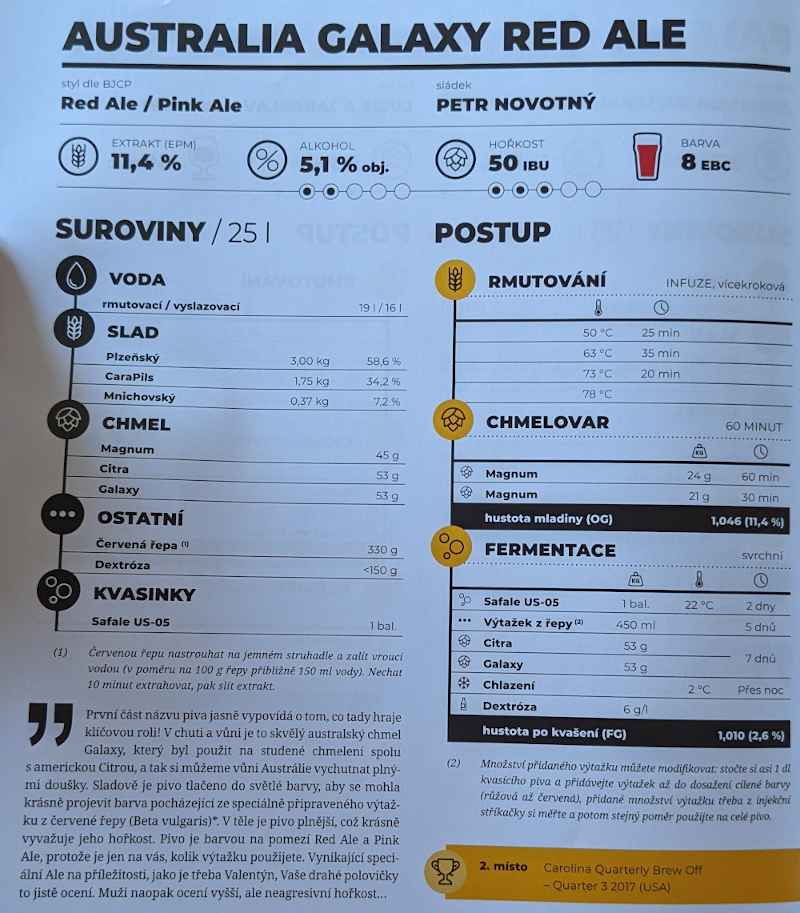

# Drakulovo hrich

## 14.6.2022
  * start: 9:00
  * sladci: Pivel, Matej, sladek Vita, Dan
  * stav plynu pred: 4930.60, po: 4931.78 => 1.18 m3 == 0.01266 MWh => 2150 Kc/MWh => ~30 Kc

### Rmutovani
  * slady: Plzensky 3kg, CaraPils 1.75kg, Mnichovsky 600g, Pale Ale 700g
  * rmutovaci voda 20l, vyslazovaci 18l
  * 25 min 54C, 35 min 65C, 20 min 73C, na 78C a utnuti
  * jodova zkouska ok
  * scezeno 27l

### Chmelovar
  * Simcoe 35g na 60 min
  * Simcoe 30g na 32 min
  * Irsky mech 2g na 2 min
  * Ztraty 5.5l (20%)

### Fermentace
  * Kvasinky: Safale US-05
  * Uzavreno 16:00, OG 1057 g/cm3, EPM 14.3°
  * stoceno 21.5l
  * teplota fermentace okolo 24-25C (venku je vedro) => primarni kvaseni zapocalo jeste v den uzavreni
  * 16.6. 19:00:
    * otevreno, sebrane hnede kaly
    * doliti 270ml vyvaru z cervene repy: 330g predvarene repy, zalito horkou vodou cca 300ml, rozmackano na kousky, po 10 minutach slito
    * FG 1037 g/cm3, ABV 2.7%, stale kvasi
    * stale teploty 24-25C
  
### Staceni
TODO

## Puvodni recept: Australia Galaxy Red Ale

