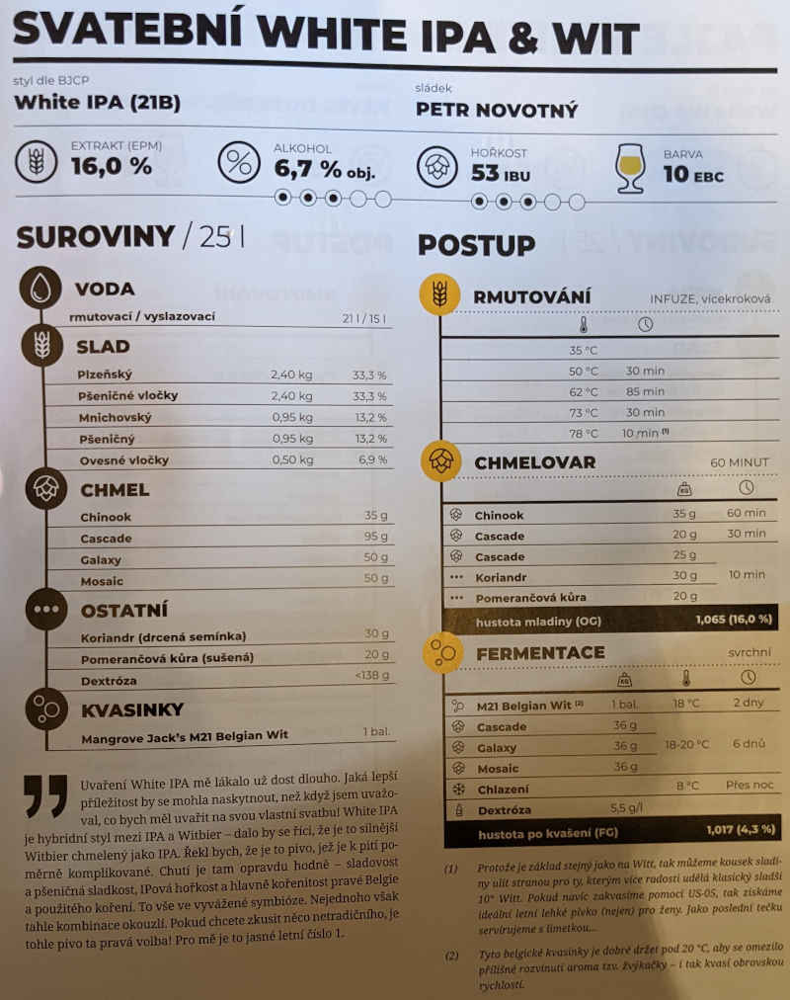

# Gwynbleidd

## 1.5.2021
  * start: 9:00
  * sladci: Pivel, Martin

### Rmutovani
  * 23.5l rmutovaci voda, 15l vyslazovaci
  * slady: 1kg Psenicny, 700g Mnichovksky, 525g ovesne vlocky, 2.4kg psenicne vlocky, 2.4kg Plzensky
  * vystirka pri 40C
  * 30 min 50C, 85 min 60-68C, 30 min 72C, 10 min 78C
  * jodova zkouska ok

### Chmelovar
  * 35g Chinook na 60 min
  * 25g Cascade na 30 min
  * 25g Cascade, 26g mlety koriandr, 22g pomrdancova kura na 10 min

### Fermentace
  * Kvasinky: M21 Belgian Wit
  * Uzavreno 5:55 PM (post mortem / Martin prdi), OG 1062 g/cm3, EPM 15.3° 
  * stoceno 23l, kvasna nadoba schovana za Velikonocni pyramidu
  * 4.5. 20:00 chmeleni za studena:
    * 36g Galaxy, 36g Mosaic, 36g Cascade

#### Ilustrace procesu vyroby piva Branik v pivovaru Staropramen, Martin Copyright

### Staceni
  * 10.5.
  * FG 1.023 g/cm3, 5.7% ABV
  * 20l
  * 17 x 0.75l, 1 x 1l, 8 x 0.5l, 4 x 0.33l, 1 x 0.355l

## Puvodni recept: Svatební White IPA & WIT

