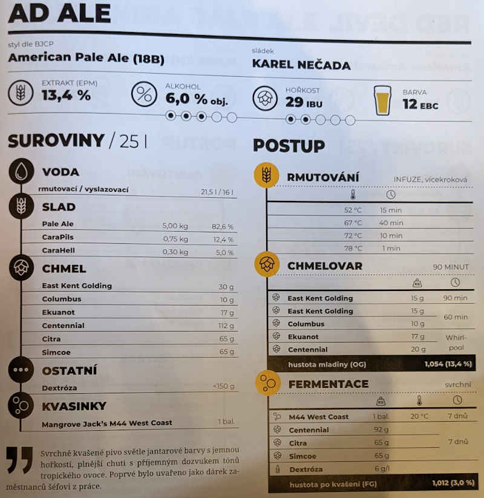

# Janicka

## 27.3.2021
  * start: 10:00
  * sladci: Pivel, Martin, Dan, Matej, Honik

### Rmutovani
  * slady: Pale Ale 5kg, CaraPils 850g, CaraAmber 300g
  * vystirka na 52C
  * rmutovaci voda: 22.5l, vyslazovaci voda 16l
  * 15 min 52C, 40 min 67C, 10 min 72C, 1 min 78C (max 1C/1min)
  * jodova zkouska ok

### Chmelovar
  * East Kent Golding 15g na 90 min
  * East Kent Golding 15g, Nelson Sauvin 10g na 60 min
  * Simcoe 17g, Centennial 20g do whirlpoolu

### Fermentace
  * Kvasinky: M44 West Coast
  * Uzavreno 17:00, OG 1055 g/cm3, EPM 14°
  * 4.4. 11:00:
    * oproti receptu pozdrzeno o 1 den (stale probihalo primarni kvaseni)
    * Centennial 80g, Cascade 12g, Citra 100g, Simcoe 35g chmeleni za studena
    * FG 1013 g/cm3, ABV 5.5%
  
### Staceni
  * 11.4. 16:00
  * FG 1022 g/cm3
  * 19l
  * 22 x 0.75l, 1 x 1l, 2 x 0.5l, 1 x 0.33l

## Puvodni recept: AD Ale

