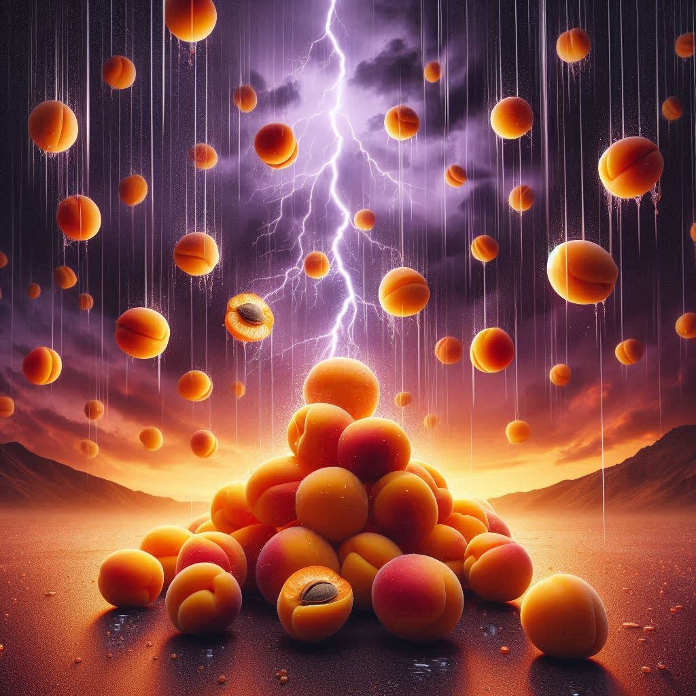
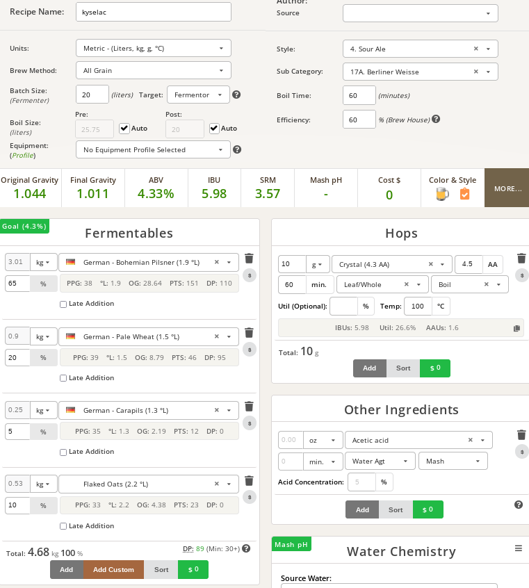

# Marhuľový vietor

## 4.7.2024
  * start: 17:00
  * sladci: Pivel, Matej, Vit

### Rmutovani
  * slady: Plzensky 3.0 kg, Psenice 1 kg, Karamel 0.30 kg, Ovesne vlocky 0.525 kg
  * **rozbity teplomer ukazuje o +15C vice a posunuta ryska na objem vody ukazuje o +2l vice (na 10l)**
  * vystirka na 57C
  * teplota cca: 30 min 60C, 20 min 68C
  * jodova zkouska ok
  * scezeno 28l

### Mlecne kvaseni
  * start na 42C
  * kvasinky: WildBrew sour pitch (zeleny), 10g (hydratace v 50 ml voda a 50 ml rmut)
  * 10 ml kyselina mlecna
  * pH -> 4 a mene (cervenejsi nez ryska)
  * OG 1031 (8 plato)
  * ohrev na 30-40C -> nadoba v pytli ve vane, 3x vymena za vodu 42C
  * 5.7. 10:00: mlecne kvaseni ok, chutove dobre s tropickym nadechem, kyselost ok (PP: mam radsi mene, 4.7. 18:00 byla akorat)

## 5.7.2024

### Chmelovar
  * Crystal 10g na 60 min
  * schlazovani cca 15 min

### Fermentace
  * Safale US-05 11.5g
  * 24l na rysce -> ~22l real
  * preneseno do sklepa s 20C
  * stoceno s celkem dost bordelu (zapomneli jsme udelat whirlpool a nechat usadit pri schlazovani
  
### Staceni

### Ochutnavky

### Recept

