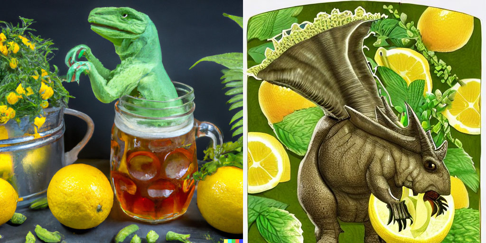
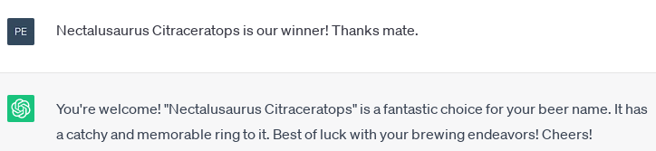
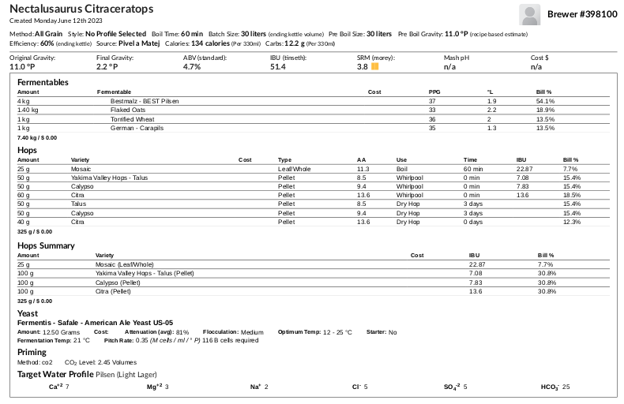

# Nectalusaurus Citraceratops

## 13.6.2023
  * start: 9:00
  * sladci: Pivel, Matej

### Rmutovani
  * slady: Plzensky 4.0kg, CaraPils 1kg, Ovesne vlocky 1.4kg, Torrefikovana psenice 1kg
  * vystirka na 62C
  * rmutovaci voda: 24.7l do vystirky
  * 60 min 70C, 40 min zchlazujeme dolu az na 58C (tzv. inverzni rmut, Copyright Pivovar Topivec)
  * vyslazovaci voda 10l hrnce + 5.1l z konvice (70C)
  * jodova zkouska ok
  * scezeno 29l, po filtraci nejakych 25l do chmelovaru

### Chmelovar
  * Mosaic 26g na 60 min
  * Protafloc 0.9g tbl na 8 min
  * Nectaron (alfa: 9.4%), Talus (alfa: 8.5%), Citra (alfa: 13.6%) po 50g kazdy do whirlpoolu

### Fermentace
  * Kvasinky: Safale US-05
  * Uzavreno 15:30, OG 1047 g/cm3, EPM 12°
  * stoceno 20.5l (varne ztraty a vylito tak 4-5l sedliny)
  * 15.6.: plna palba, probublava jak po Primator Hron 12°
  * 17.6. dry hopping: Citra 49.2g, Talus 49.6g, Nectaron 50.8g
  
### Staceni

### Ochutnavky

## Recept: vlastni (inspirace Ponozky)

  * misto Calypso Nectaron (Brewer's friend neznal)
  * Citra 50g ve whirlpoolu a 50g v dry hopu
