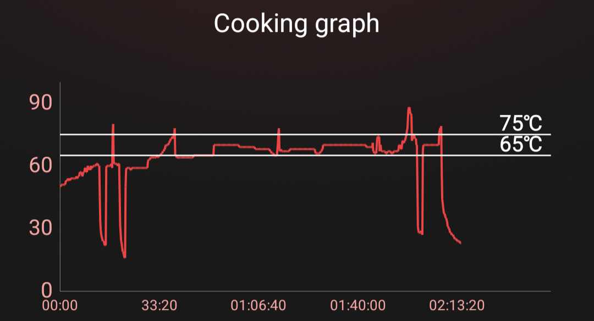
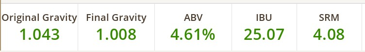
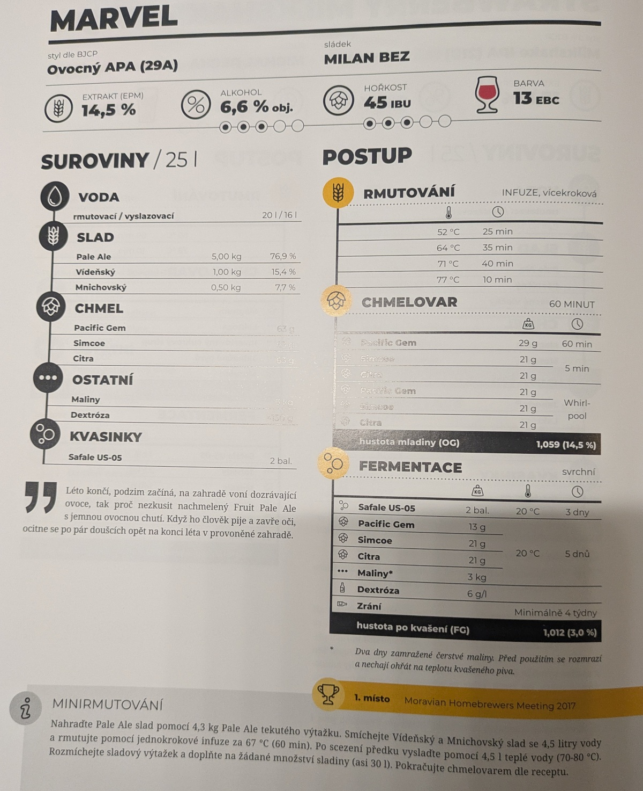

# Nevěsta

## 8.3.2025
  * start: 12:30
  * sladci: Pivel, Verunka

### Rmutovani
  * slady: Pale Ale 4 kg, Vidensky 0.5 kg, Mnichov 0.3 kg
  * 25 min @ 64C, 25 min @ 69C, 1 h @ 65-69C
  * vyslazovaci voda na max kapacity
  * jodova zkouska nedelana

### Chmelovar
  * start objem: plnej hrnec (nevejde se uz ani litr)
  * 10 g Citra @ 60 min
  * 5 g Citra  @ 40 min (pridano navic, byl overflow peny s chmelem)
  * 10 g Citra @ 5 min
  * 5 g Citra  @ Whirlpool
  * 20 g HBC 1019 @ Whirlpool

### Fermentace
  * Safale US-05 11.5g
  * uzavreno 18:15 
  * OG 1040 g/cm3, EPM 10.5° (podle hustomeru)
  * OG 1055 g/cm3, EPM 14° (podle fazole)
  * 25l na rysce -> 23l real
  * TODO: 70 g Citra @ XXX days

### Staceni

### Target

### Inspirace: MARVEL

