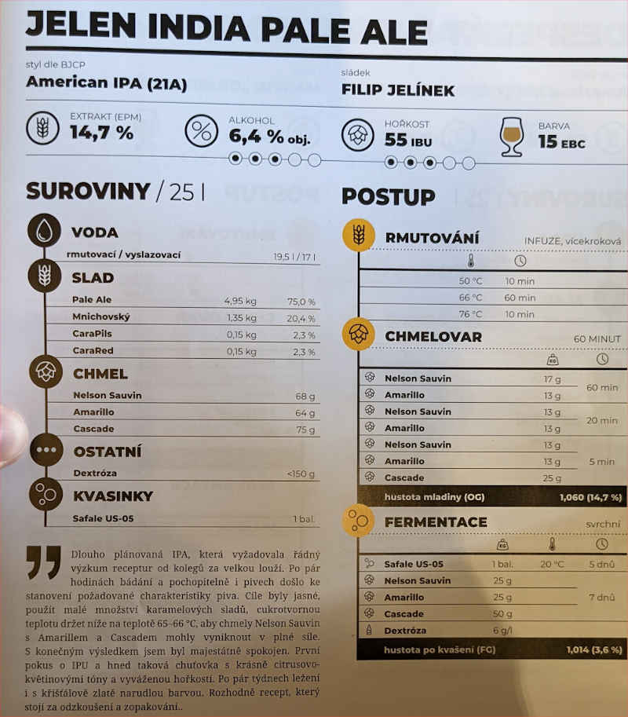

# Práh

## 13.3.2021
  * start: 10:00
  * sladci: Pivel, Martin, Honik, Dan

### Rmutovani
  * 22l rmutovaci voda, 17l vyslazovaci
  * slady: 5kg Pale Ale, 1.35kg Mnichovksky, 150g CaraPils, 150g CaraRed
  * 10 min 53C, 10 min > 50C, 50 min 65C, 10 min 76C
  * jodova zkouska ok (nemohli jsme najit jod, nakonec jsme nasli), scezeno 28l

### Chmelovar
  * 17g Nelson, 13g Amarillo na 60 min
  * 13g Nelson, 13g Amarillo, 2.5g Irsky Mech na 20 min
    * vkladame chladic 
  * 13g Nelson, 13g Amarillo, 25g Cascade na 5 min
    * zaciname regenerovat kvasinky

### Fermentace
  * Kvasinky: Safale US-05
  * Uzavreno 17:00, OG 1060 g/cm3, EPM 15°
  * 18.3. chmeleni za studena:
    * 25g Nelson, 25g Amarillo, 50g Cascade
    * FG 1.0165 (5.8% ABV)
    * odebrany hnede kaly, ovocna vune
  * 19.3. ukonceno primarni kvaseni

### Staceni
  * 25.3.
  * FG 1.017 g/cm3, 5.8% ABV
  * 19l, chut genericke IPA
  * 21 x 0.7l, 1 x 1l, 3 x 0.33l

## Puvodni recept: Jelen IPA

