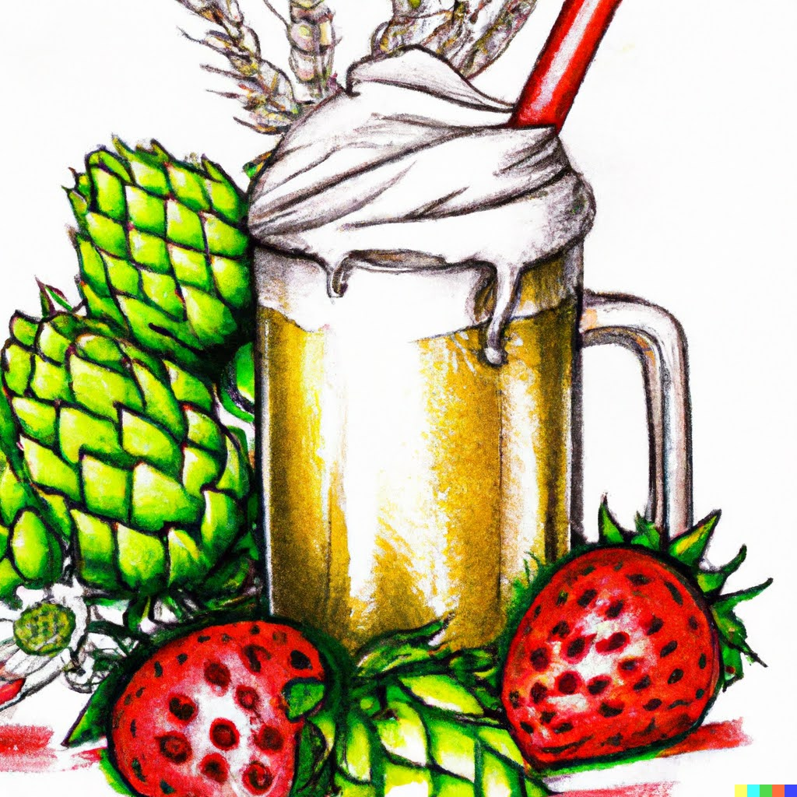
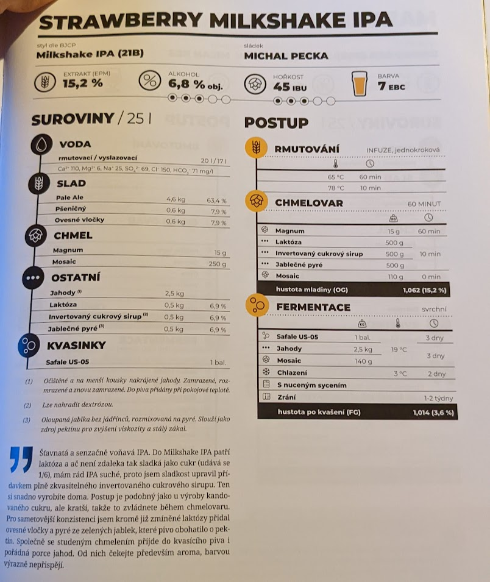

# Sex-hop fragum

## 23.8.2022
  * start: 9:00
  * sladci: Pivel, Matej, Honzik
  * fotoalbum: [Google Photos](https://photos.app.goo.gl/qUf6sjMaF7uMJ6ABA)

### Rmutovani
  * slady: 5kg Pale Ale, 600g Psenicne vlocky, 600g ovesne vlocky
  * rmutovaci voda 23l, vyslazovaci 17l
  * 60min 65-68C, 68-78C, 10 min 78C
  * invertni cukrovy sirup: 1kg bileho cukru, 600ml vody, 1 lzicka kys. citronove -> varime hodinu
  * cca 30l sladiny
  * jodova zkouska neprovedena

### Chmelovar
  * 60min: Magnum 15g
  * 10min: jablecne pyre (cervena jablka, 500g bez slupek a jadrincu, namleto na pyre), laktoza 500g, invertni cukrovy sirup 500g
  * 0min: whirlpool z Citra 51.7g, Simcoe 35.4g, Cascade 23g

### Fermentace
  * Kvasinky: Safale US-05
  * Uzavreno 16:00, OG 1044 g/cm3, EPM 14.1°
  * Stoceno 26.5l
  * Fermentace pri vyssich teplotach (az 26C)
  * 25.8.: preneseno do sklepa, kde je 20C (primarni kvaseni jiz ukonceno)
  * 27.8.: 
    * 2840g jahod (bez stopek, nakrajene na cca 1cm kousky, ve 2 pytlicich)
    * Mosaic 99.3g, Cascade 39g (samostatny pytlik se zavazim)
    * FG 1019 g/cm3, ABV: 3.28%
  * 29.8.: Ze sklepa do bytu kde je cca 22C
  * 1.9.: Cele dilo do lednice 
  
### Staceni
  * 3.9.: stoceno 19l, 5l do plastovych krabicek, pac nebylo vic lahvi :(
  * 5.9.: stoceno zbylych 5l
  * oboje s glukozou 6 g/l
  * celkem ~24l: 15x0.7l, 16x0.5l, 1x2l, 2x1l, 5x0.33l
  * FG 1018 g/cm3, ABV: 3.41%
  * chut: citrusova (nejvice grapefruit)
  * 11.9.: lahve do lednice

### Ochutnavky
  * 10.6.2023 [Pivel]: mnaaaaaaaaaaaam, tak krasne jahodove, nasycene, zakulacene, vyvazene.. jak vune, tak chut

### Zasoby chmele pred
  * Simcoe 35.4g
  * Citra 52g
  * Galaxy 42g

## Puvodni recept: Strawberry Milkshake IPA

