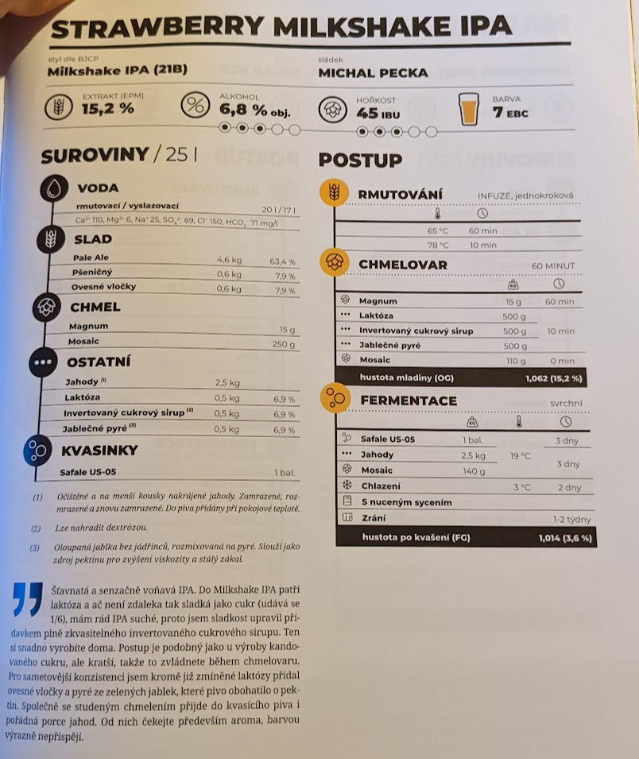

# Sex-hop fragum

## 23.8.2022
  * start: 9:00
  * sladci: Pivel, Matej, Honzik

### Rmutovani
  * slady: 5kg Pale Ale, 600g Psenicne vlocky, 600g ovesne vlocky
  * rmutovaci voda 23l, vyslazovaci 17l
  * 60min 65-68C, 68-78C, 10 min 78C
  * invertni cukrovy sirup: 1kg bileho cukru, 600ml vody, 1 lzicka kys. citronove -> varime hodinu
  * cca 30l sladiny

### Chmelovar
  * 60min: Magnum 15g
  * 0min: whirlpool z Citra 51.7g, Simcoe 35.4g, Cascade 23g
  * jablecne pyre: cervena jablka, 500g bez slupek a jadrincu, namleto na pyre

### Fermentace
  * Kvasinky: Safale US-05
  * Uzavreno , OG g/cm3, EPM °
  * stoceno l
  * DH: Galaxy, Mosaic
  
### Staceni

### Zasoby chmele pred
  * Simcoe 35.4g
  * Citra 52g
  * Galaxy 42g

## Puvodni recept: Strawberry Milkshake IPA

