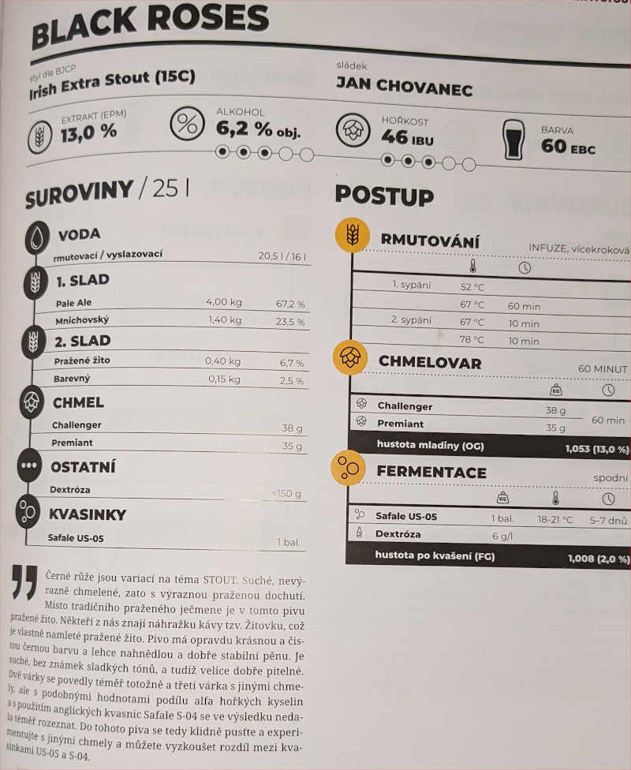

# Svetr

## 7.11.2021
  * start: 11:00
  * sladci: Pivel, Martin, +2 dalsi TODO

### Rmutovani
  * rmutovaci voda 20.5l, vyslazovaci 16l
  * 1. sypani: Pale Ale 4kg, Mnichovsky 1.4kg
    * pri 52C
    * pridavame jeste +2 hrnce s kytickama (~8l) rmutovaci vody
    * 60 min na 52C, pak ohrev na 67C
  * 2. sypani: Prazene zito 400g, Barevny 150g
    * 10 min 67C, 10 min na 78C
  * jodova zkouska ok
  * scezeno 28 l

### Chmelovar
  * Challenger 38g, Premiant 35g na 60 min
  * Ztraty 4.4l (15%)

### Fermentace
  * Kvasinky: Safale US-05
  * Uzavreno 18:00, OG 1052 g/cm3, EPM 13.2°
  * stoceno 23.8l
  
### Staceni
  * 15.11.
  * FG 1020 g/cm3, ABV 4.3%
  * 22l, 101g dextrozy
  * 18 x 0.7l, 1 x 2l, 2 x 1l, 7 x 0.5l, 2 x 0.3l

## Puvodni recept: Black Roses

