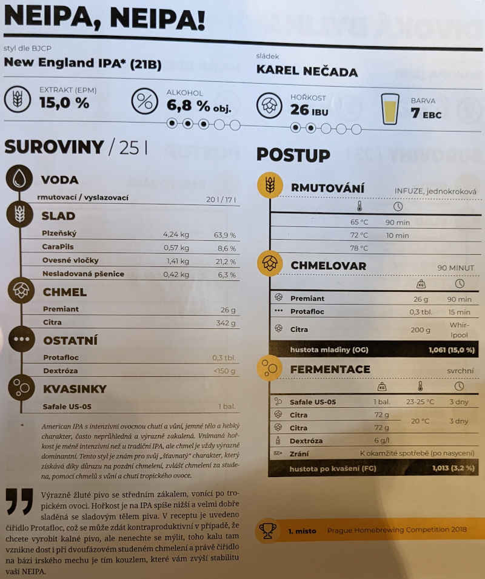

# Ženich

## 23.2.2025
  * start: 13:00
  * sladci: Pivel, Matej

### Rmutovani
  * slady: Plzensky 4.2 kg, CaraPils 0.6 kg, Psenicny 0.4 kg, Ovesne vlocky 1.0 kg, Psenicne vlocky 0.5 kg
  * vystirka na 65C
  * rmutovaci voda: co se veslo do hrnce
  * teplota cca: 60 min 65C, pak nam to vystrelilo na 90C, tak jsme sli vystirat
  * jodova zkouska: OK
  * scezeno: plny bily hrnec

### Chmelovar
  * 90 min
  * Whirlpool: 200g HBC1019

### Fermentace
  * Safale US-05 11.5g
  * dextroza 160 g (melo by pridat cca 0.41% ABV)
  * stoceno 18:45
  * OG 1049 g/cm3, EPM 13°
  * 25l na rysce -> ~23l real
  * !!! zacla az o 2 dny pozdeji
  * !!! po 1 dni presunuta do sklepa (8C)
  * !!! 5 dni kvaseni ve sklepe (8C), ale bylo vesely
  * nedele 2.3. (stari 1 tyden) presun domu do 19C
    * insert Fazole (KegLand) a 144g HBC1019

### Puvodni recept: NEIPA, NEIPA!

